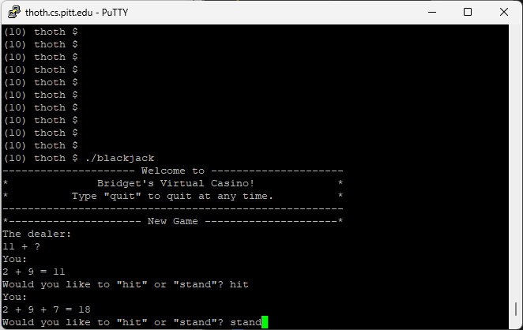
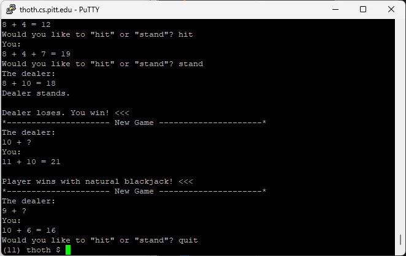
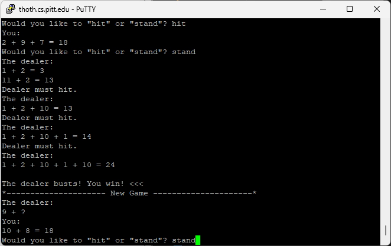
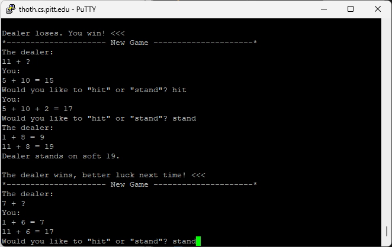

# Blackjack Simulator

Welcome to **Bridget's Virtual Casino!** This is a single-player Blackjack simulator built in C for a project in **CS449 - Introduction to Systems Software**. Play against the computer in this text-based game and see if you can beat the dealer!

---

## Table of Contents
- [Features](#features)
- [Getting Started](#getting-started)
- [Gameplay](#gameplay)
- [How It Works](#how-it-works)
- [Code Structure](#code-structure)
- [Future Enhancements](#future-enhancements)
- [Author](#author)

---

## Features
- Single-player Blackjack against the computer dealer.
- Implements standard Blackjack rules:
  - Dealer must hit if their hand is less than 17.
  - Aces can be counted as 1 or 11 depending on the player's advantage.
  - Natural Blackjack detection.
- Continuous gameplay with the option to quit at any time.
- Random card dealing using `rand()` for an infinite deck simulation.

---

## Getting Started

### Prerequisites
To run this project, you'll need:
- A C compiler (e.g., GCC).
- Basic familiarity with terminal/command-line usage.

### Compilation
Compile the program using the following command:
```bash
gcc -o blackjack blackjack.c
```

### Running the Program
Run the executable to start the game:
```bash
./blackjack
```

---

## Gameplay

1. The dealer and player are each dealt two cards at the start.
2. The player chooses to:
   - `hit` to draw another card.
   - `stand` to end their turn.
   - `quit` to exit the game.
3. The dealer plays their turn automatically according to Blackjack rules.
4. The winner is determined based on the totals of the hands:
   - Natural Blackjack wins immediately.
   - A hand closer to 21 without exceeding it wins.
   - Ties result in a draw.

---

## How It Works

### Card Dealing
- Cards are represented as integers (1-10).
- `rand()` simulates an infinite deck with probabilities adjusted for Blackjack.

### Hand Tallying
- Aces are dynamically counted as 1 or 11 depending on the player's best outcome.

### Gameplay Logic
- The dealer's second card remains hidden until their turn.
- Comprehensive checks for busts, ties, and Blackjack rules.

---

## Code Structure

### Main Components
- `deal_card()`: Simulates drawing a random card.
- `tally_hand()`: Calculates the total of a hand.
- `reset_hand()`: Prepares hands for a new round.
- `get_input()`: Reads and processes player input.
- `print_cards()`: Displays the current cards and totals.
- `check_naturals()`: Checks for immediate Blackjack outcomes.

### Design Philosophy
The code uses arrays to represent hands and separate arrays for handling Aces. Modular functions keep the gameplay logic organized and easy to debug.

---

## Demo

### Game Start
The game begins with a welcome message and initial card deals:  


### Player Wins
An example where the player wins by standing with a higher hand than the dealer:  


### Dealer Busts
The dealer busts, and the player automatically wins:  


### Dealer Wins
An example where the dealer wins by having a higher hand than the player:  


---

## Future Enhancements
- Add a betting system to simulate real casino gameplay.
- Implement a graphical or web-based UI for a more immersive experience.
- Enhance card-dealing randomness using cryptographic libraries.
- Support multiple players.

---

## Author
**Bridget Brinkman**  
GitHub: [@F5F0A0](https://github.com/F5F0A0)  
Project for **CS449 - Introduction to Systems Software**, Summer 2024.